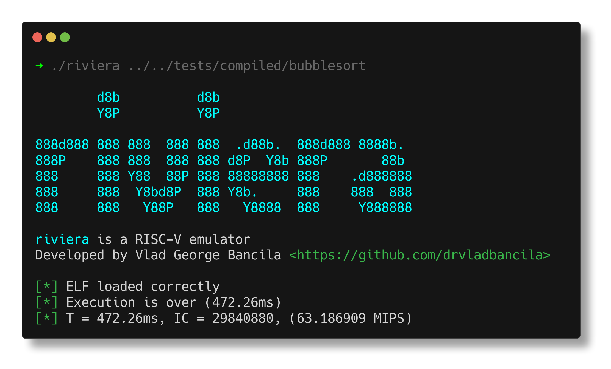

# riviera

*riviera* stands for: **RI**SC-**V** **I**mprobable **E**mulator, **R**ust **A**ssisted.

As the name suggests, it is a RISC-V emulator written in Rust.

It is currently a work in progress in the early stages and supports RV32I and RV64I.



As for now, I could get a performance of around 50-65 MIPS.

## Building and running

To get the emulator running, first clone the repo and then build it with cargo:

```
git clone https://github.com/drvladbancila/riviera
cargo build --release
```

In order to get it running
```
cargo run --release  -- <arguments>
```

## Compiling and runnign executables

Programs need to be compiled without standard C library and (for now) with the `-march=rv64g` flag as this instructs the compiler to use only __non-compressed__ instructions (support may be added in the future).
Like this:
```
riscv64-unknown-linux-gnu-gcc -march=rv64g -nostdlib <file.c> -o <output_file>
```

To run an ELF file and obtain execution time, number of instruction and MIPS:
```
cargo run -- <ELF executable>
```

Other parameters are:

    - d <file>: dump DRAM content to binary file
    - r <n>: dump register contents on screen every <n> executed instructions
    - m <size>: set the DRAM size to <size>

For other usage parameters run with the `--help` flag.

## Testing

Some programs that can be run and used to test the emulator are put in the `tests` folder.
To automatically compile the tests:

```
cd tests
chmod +x compile.sh
./compile.sh
cd ..
```

Executables are stored in the `tests/compiled` folder.

To execute a test, run:

```
cargo run --release -- tests/compiled/<testname> <other params...>
```


## TODOs

- [ ] Spport for compressed instruction
- [ ] Framebuffer for displaying user output
- [ ] Module to extract statistics from running code 
