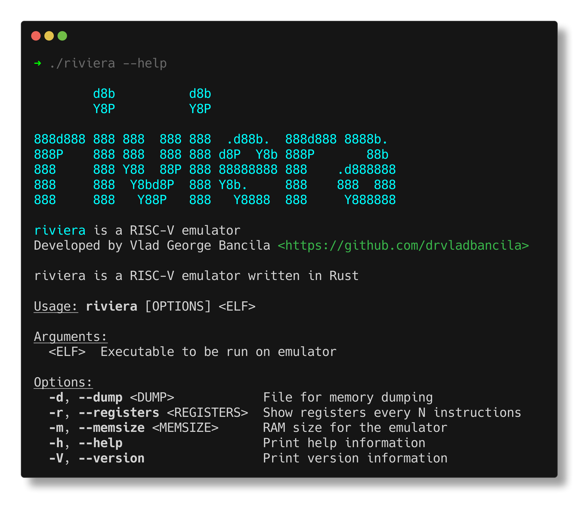

# riviera

*riviera* stands for: **RI**SC-**V** **I**mprobable **E**mulator, **R**ust **A**ssisted.

As the name suggests, it is a RISC-V emulator written in Rust.

It is currently a work in progress in the early stages and supports RV32I and RV64I.



## Building and running

To get the emulator running, first clone the repo and then build it with cargo:

```
git clone https://github.com/drvladbancila/riviera
cargo build --release
```

In order to get it running
```
cargo run  -- <arguments>
```

## Running executables

## Testing

```
riscv64-unknown-linux-gnu-gcc -march=rv64g -nostdlib <file.c> -o <output_file>
```

## TODOs

- [ ] Spport for compressed instruction
- [ ] Framebuffer for displaying user output
- [ ] Module to extract statistics from running code 
